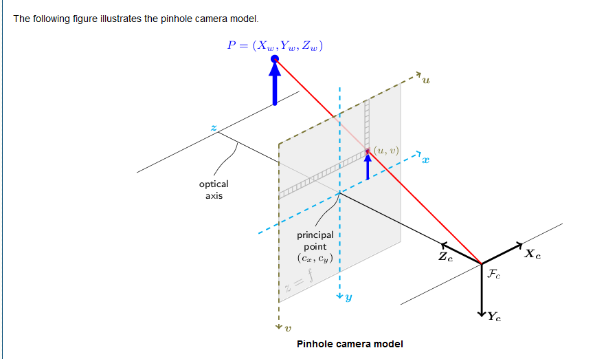
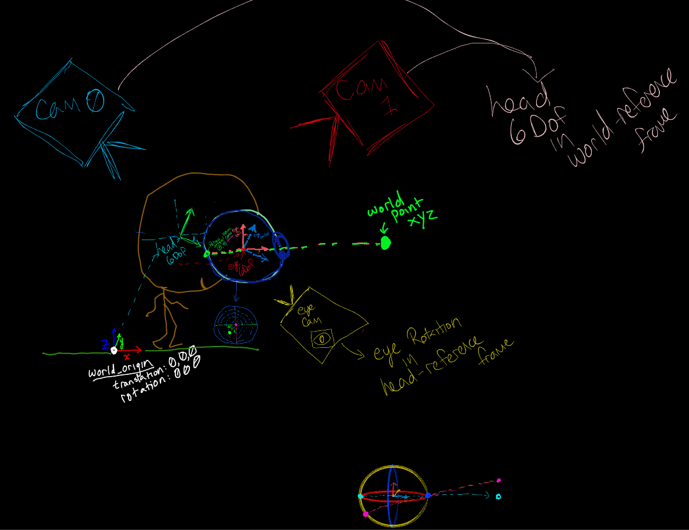

# Retinal Projection Math

## Desidirata - ** Retinal Projection of World Points ** 
- Considering data at a singular timeslice (i.e. a single frame from a recording stream)
- Need 6 degree of freedom (6DoF) location of `eye_socket` in world coodinates
    - need `eye_socket_basis_vectors` (Eye socket 6 DoF position)
- Need `eye_ball_orientation` within the eye_socket reference frame

### How to get `eye_socket_basis_vectors`
  - Define relative to `skull_basis_vectors`
  - How to get `skull_basis_vectors`
    - Estimate **3d keypoints** on skull from **mocap system** <<-- (Cameras + Calibration + DeepLabCut (or similar))
    - Calculate `skull_basis_vectors` using **rigid body analysis** 
    - Define eyeball center relative to `skull_basis_vectors`

### How to get `eye_ball_orientation`
  - tl;dr - hopefully the **Pupil Labs eye tracker** does this for us, otherwise we can do it ourselves 
  - View eyeball from `eye_camera` 
  - Estimate pupil elipse via **dark pupil tracking**
  - Use pupil elipse to estimate eye orientation in eye-camera (head) refrence frame <<--(Pupil labs or whatever other eye tracking methods)
    - I think its like - the position is in eye-camera coordinates, but the orientation is the same as in head coordinates because the eye camera is rigidly attached to the head or something? 

### Resources
- OpenCV Camera Calibration docs defines all the basic projective geometry math we'll need here - https://docs.opencv.org/4.10.0/d9/d0c/group__calib3d.html
- 

----
World -> head -> eye-socket -> eye-ball -> retinal projection 

