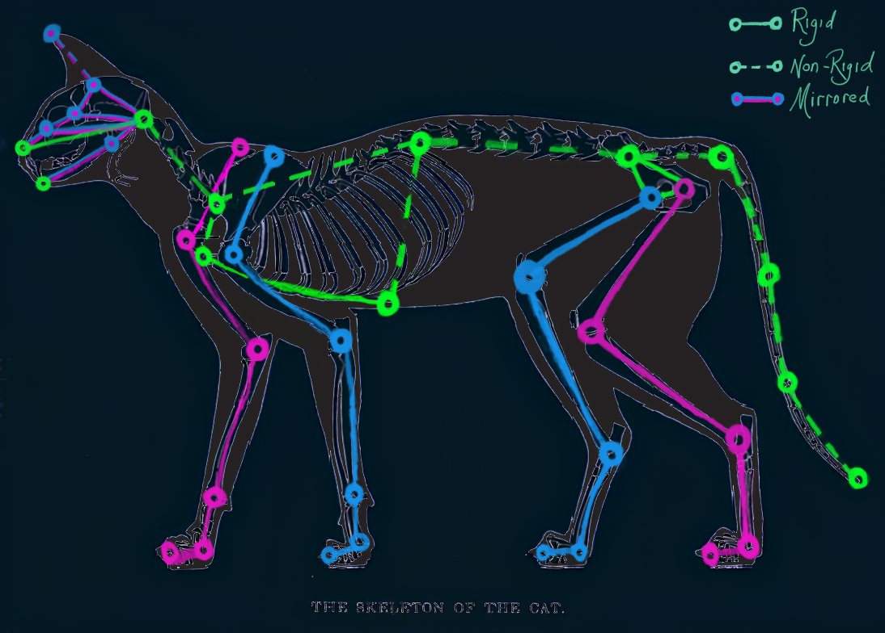
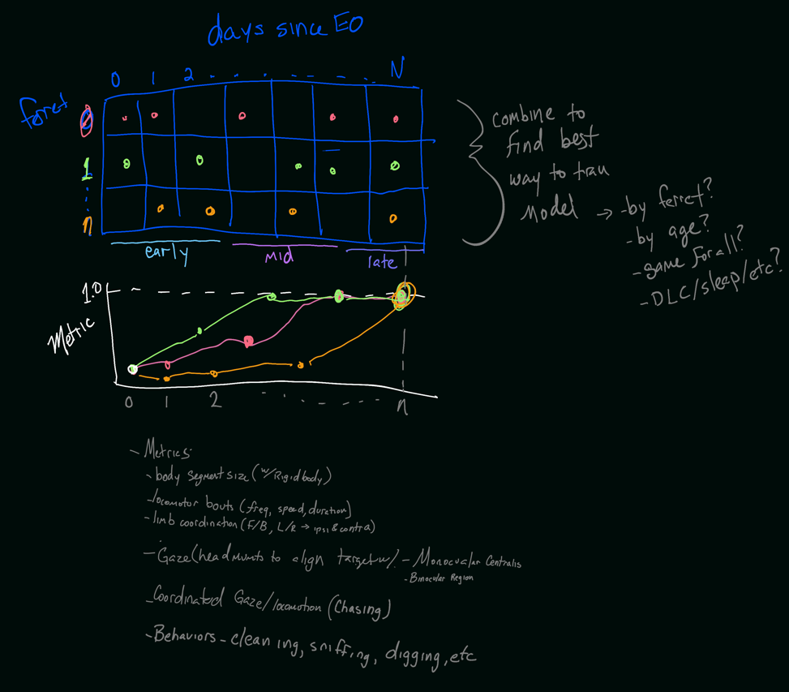
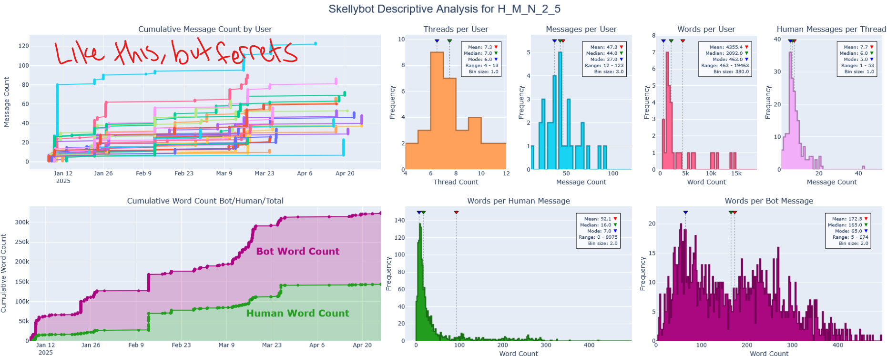

# Ferret Research Planning

## 2025-07-22

### Goals before SfN 
- **Full-body mocap** using keypoints similar to this (simplifying some spots):

- **Pupil tracking** with
    - Elipse w/ at least 8 points around the pupil
    - Arc track of upper and lower eye lid (~4-6 points per arc)
    - 1 point per main CR 
    - 4 points on each of the eyelid IR reflections
- Integrated ferret laser skeletons
- Synchronize w/ neuropixels
- Flatten 3d capture volume by applying intrinsics corrections
    - recreate 3D animations from Em's talk and compare with and without corrections
- **Data Management**
    - Review and revise recording folder structure
    - Implement auto-backup data (via cron job)
    - Implement auto-generate secondary analyses (ESP MOSAIC VIDEO) (after recording or via cron job)

## 2025-06-03 - 
### Perform a battery of assessments on each recording from each animal to simultaneously develop reconstruction/analysis pipelines alongside scientifically interesting longitudinal developmental profiles

#### Model training
- Label enough frames per recording to establish viable full-body tracking (according to defined performance diagnostic criteria, e.g. reprojection error and rigid body residuals)
- Explore different combinations of data and parameters to evaluate against different strategies, e.g.: 
    - One big model for every animal/age
    - Dedicated model per animal
    - Dedicated model per age
    - Dedicated model per recording

#### Longitudinal developmental metrics
- Calculate various metrics per recording
- Create longitudinal trajectories per animal, and collapsed across animals
- Normalize each metric for each animal by that animal's score at their oldest timepoint 

### Example metrics: 
- Body segment size (related to `rigid body` diagnostics)
- Locomotion
    - Bout frequency
    - Mean distance/duration (i.e. speed)
    - Path curvature
- Limb coordination 
    - Front/Back, Left/Right, ipsi/contra-lateral coordination
- Gaze Behavior
    - Head (eye?) movements that move target into: 
        - Monocular fovea centralis
        - Binocular overlap region
- Coordinated Gaze/Locomotion (chasing behaviors)
- General Behaviors, e.g.
    - Cleaning
    - Sniffing
    - Burrowing, etc
